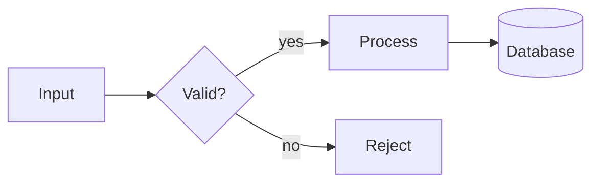
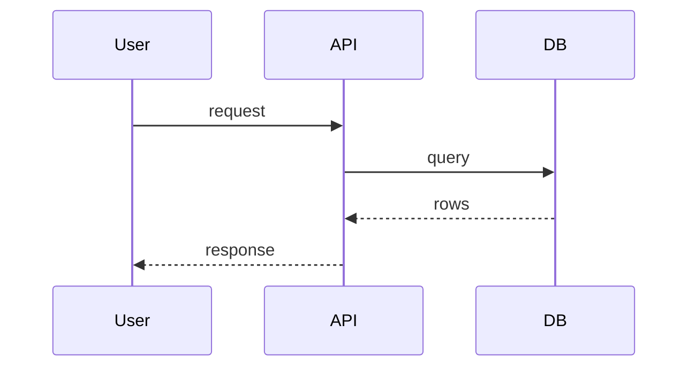
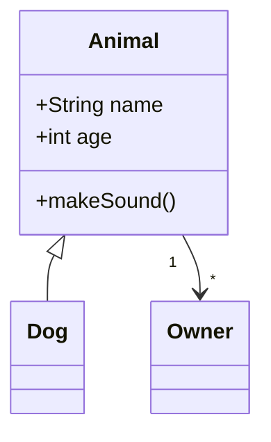
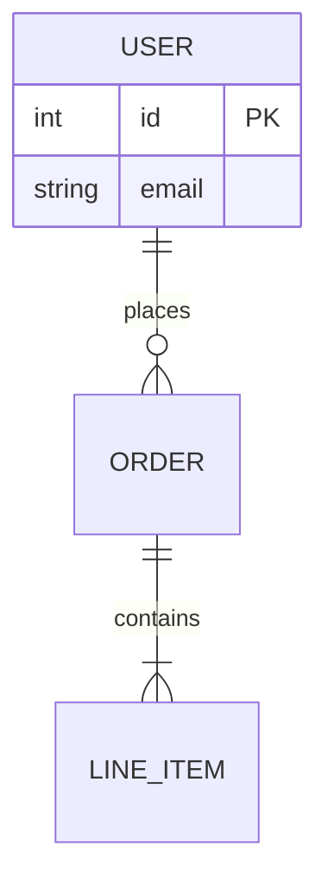
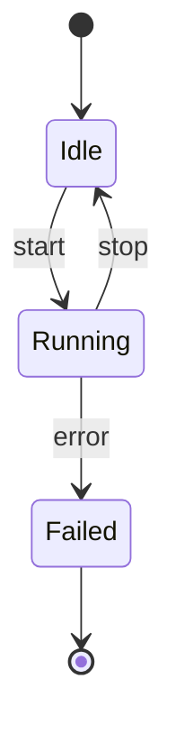
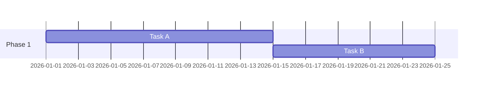
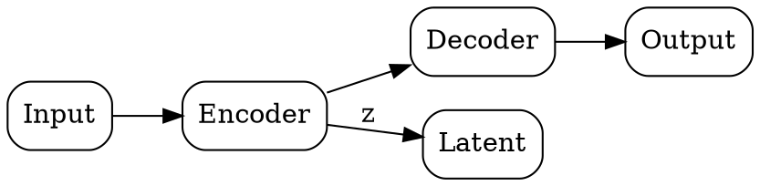
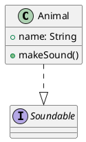

# Technical Diagrams

Consolidates diagram generation across formats. Pick the tool by what the diagram needs, not by habit — the table below is the router.

## Choosing a format

| Need | Use | Why |
|---|---|---|
| Renders inline in GitHub/GitLab/most markdown, Claude Artifacts | **Mermaid** | Native rendering everywhere, good default |
| Directed graphs with many nodes, precise layout control | **Graphviz (DOT)** | Mature layout engine (`dot`, `neato`, `fdp`), best for large graphs |
| Modern, terse syntax; SQL-table/architecture diagrams | **D2** | Cleanest syntax for architecture and infra diagrams; needs the `d2` CLI or playground to render |
| UML-heavy (sequence, class, component, deployment) with strict UML semantics | **PlantUML** | Most complete UML spec coverage; needs a PlantUML renderer |
| Quick sketch in a terminal/README, no renderer available | **ASCII art** | Zero dependencies, degrades gracefully in plain text |

Default to Mermaid unless one of the other rows' conditions clearly applies.

## Mermaid

Six diagram types cover most needs. Fence with ` ```mermaid `.

**Flowchart** — pipelines, decision logic:

`LR`/`TD` sets direction. Shapes: `[rect]`, `(rounded)`, `{diamond}`, `((circle))`, `[(database)]`, `[[subroutine]]`.

**Sequence diagram** — request/response flows, protocol interactions:

`->>` solid arrow, `-->>` dashed (reply), `Note over A,D: text` for annotations, `alt/else/end` for branches.

**Class diagram** — data models, OOP structure:

`<|--` inheritance, `-->` association, `*--` composition, `o--` aggregation.

**ER diagram** — database schemas:

Cardinality: `||` exactly one, `o{` zero-or-many, `|{` one-or-many.

**State diagram** — state machines, lifecycle:


**Gantt chart** — project/experiment timelines:


## Graphviz (DOT)

Best for large directed graphs where you want the layout engine to do the work:

Render with `dot -Tsvg file.dot -o file.svg` (or `neato`/`fdp`/`sfdp` for non-hierarchical layouts). Use for **network diagrams**, **database schema visualization** (nodes = tables, edges = FKs), and any graph too large for Mermaid to lay out cleanly.

## D2

Terser, good for architecture diagrams:
```d2
user -> api: request
api -> db: query
db -> api: rows
api -> user: response

db: {shape: cylinder}
```
Needs the `d2` CLI (`d2 file.d2 file.svg`) or the D2 playground — no built-in renderer in most markdown viewers, unlike Mermaid.

## PlantUML

Use when the user specifically needs UML semantics (interfaces, stereotypes, multiplicities) that Mermaid's class/sequence diagrams don't fully cover:

Needs a PlantUML renderer (`plantuml file.puml` with the jar, or a hosted server).

## ASCII art

For terminal output or plain-text contexts with no renderer:
```
+--------+     +---------+     +--------+
| Client | --> |   API   | --> |   DB   |
+--------+     +---------+     +--------+
```
Keep box widths consistent and arrows unambiguous; this is the fallback when nothing else will render, not the default choice.

## Diagram semantics → format mapping

These aren't separate syntaxes — they're diagram *purposes*, each mapped to one of the formats above:

- **Architecture / pipeline diagram** → Mermaid flowchart (simple) or D2 (many services/infra components)
- **API request-flow diagram** → Mermaid sequence diagram
- **Process flow / workflow** → Mermaid flowchart
- **Database schema** → Mermaid `erDiagram` (simple) or Graphviz (many tables, want auto-layout)
- **Network diagram** (hosts, subnets, connections) → Graphviz
- **Org chart** → Mermaid flowchart (`TD` direction) or Graphviz for large orgs
- **User-journey map** → Mermaid `journey` diagram:
  ```mermaid
  journey
      title User Signup
      section Discovery
        Visit site: 5: User
        Read docs: 3: User
      section Signup
        Fill form: 2: User
        Confirm email: 4: User
  ```
- **Mindmap** → Mermaid `mindmap`:
  ```mermaid
  mindmap
    root((Topic))
      Branch A
        Sub A1
      Branch B
  ```
- **Infographic outline** → this is a content-structuring task, not a diagram format: draft it as a numbered list of sections + the visual (chart/icon/stat) each section needs, then hand each visual to the relevant section above.
- **Presentation slide outline** → structure as a title + 3-5 bullet points per slide; for the visual content of any given slide, reuse the diagram/chart guidance above rather than treating slide-outlining as its own format.
- **SVG icon** → hand-author minimal inline SVG (`<svg viewBox="0 0 24 24">...</svg>`) directly; there's no diagram-language intermediary for single icons.

## Reviewing an existing diagram

When asked to critique or fix a diagram someone else made: check for (1) arrow direction correctness — the most common real error, (2) consistent flow direction (don't mix left-to-right and top-to-bottom in one diagram), (3) label completeness — every edge in a flowchart/sequence diagram should say what flows through it, (4) crossing edges that a layout change would avoid, (5) whether the diagram type actually fits the content (e.g. a state machine drawn as a flowchart loses the "current state" semantics).
